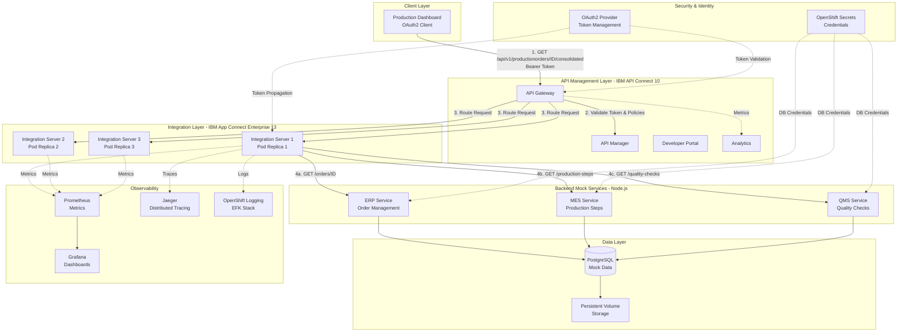
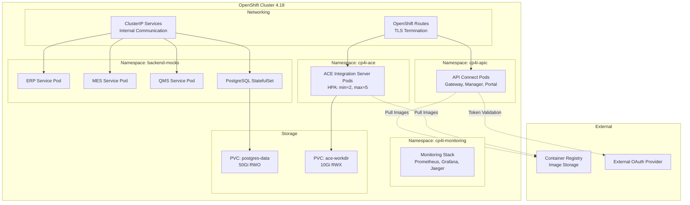
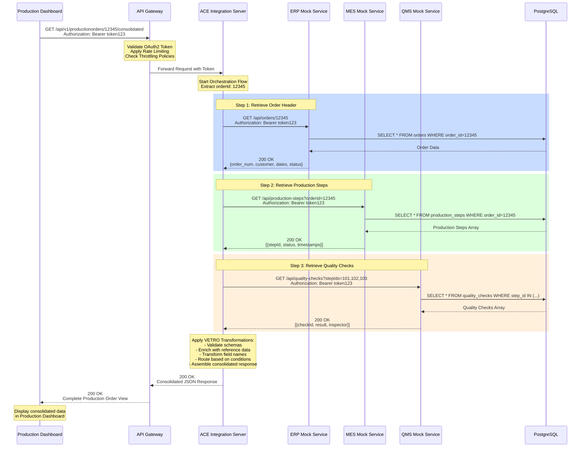
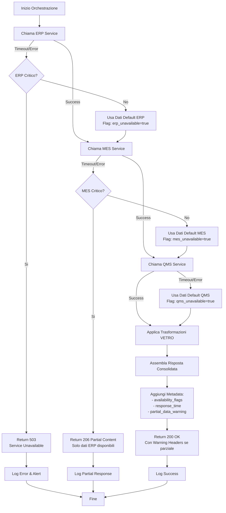
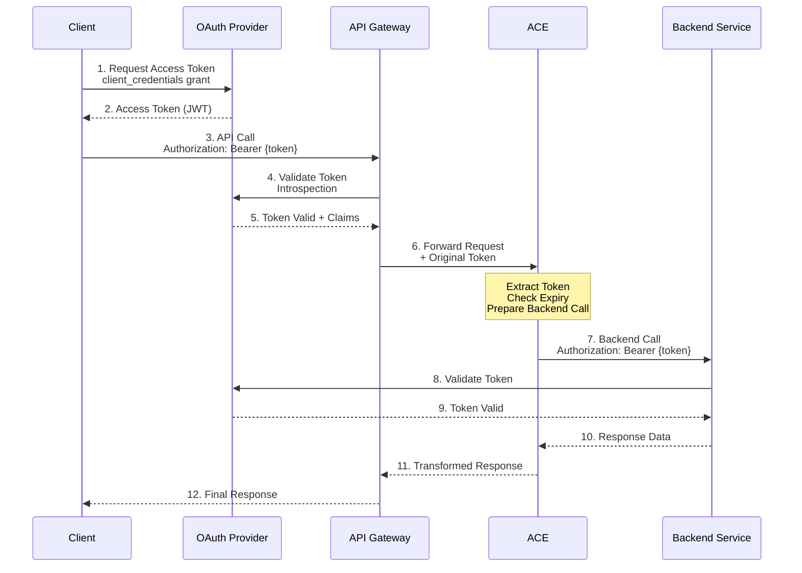

# Piano di Implementazione - Scenario A: Orchestrazione API Sincrona Multi-Sistema

## Indice
1. [Panoramica Architetturale](#panoramica-architetturale)
2. [Componenti della Soluzione](#componenti-della-soluzione)
3. [Fasi di Implementazione](#fasi-di-implementazione)
4. [Dettagli Tecnici](#dettagli-tecnici)
5. [Testing e Quality Assurance](#testing-e-quality-assurance)
6. [Deployment e Operations](#deployment-e-operations)

---

## Panoramica Architetturale

### Architettura Complessiva della Soluzione



### Deployment su OpenShift 4.18



### Flusso di Orchestrazione Dettagliato



### Gestione Errori e Fallback



---

## Componenti della Soluzione

### 1. Backend Mock Services (Node.js + PostgreSQL)

#### 1.1 Database Schema PostgreSQL

**Schema per ERP Service:**
```sql
-- Tabella Orders (ERP)
CREATE TABLE orders (
    order_id VARCHAR(50) PRIMARY KEY,
    order_num VARCHAR(100) NOT NULL,
    customer_id VARCHAR(50) NOT NULL,
    customer_name VARCHAR(200) NOT NULL,
    order_date TIMESTAMP NOT NULL,
    delivery_date TIMESTAMP,
    status VARCHAR(50) NOT NULL,
    total_amount DECIMAL(15,2),
    currency VARCHAR(3) DEFAULT 'EUR',
    plant_code VARCHAR(10),
    created_at TIMESTAMP DEFAULT CURRENT_TIMESTAMP,
    updated_at TIMESTAMP DEFAULT CURRENT_TIMESTAMP
);

CREATE INDEX idx_orders_customer ON orders(customer_id);
CREATE INDEX idx_orders_status ON orders(status);
```

**Schema per MES Service:**
```sql
-- Tabella Production Steps (MES)
CREATE TABLE production_steps (
    step_id SERIAL PRIMARY KEY,
    production_order_id VARCHAR(50) NOT NULL,
    step_number INTEGER NOT NULL,
    step_name VARCHAR(200) NOT NULL,
    workstation_id VARCHAR(50),
    operator_id VARCHAR(50),
    status VARCHAR(50) NOT NULL,
    start_time TIMESTAMP,
    end_time TIMESTAMP,
    duration_minutes INTEGER,
    quantity_planned INTEGER,
    quantity_completed INTEGER,
    created_at TIMESTAMP DEFAULT CURRENT_TIMESTAMP,
    updated_at TIMESTAMP DEFAULT CURRENT_TIMESTAMP
);

CREATE INDEX idx_prod_steps_order ON production_steps(production_order_id);
CREATE INDEX idx_prod_steps_status ON production_steps(status);
```

**Schema per QMS Service:**
```sql
-- Tabella Quality Checks (QMS)
CREATE TABLE quality_checks (
    check_id SERIAL PRIMARY KEY,
    ref_order VARCHAR(50) NOT NULL,
    step_id INTEGER NOT NULL,
    check_type VARCHAR(100) NOT NULL,
    check_parameter VARCHAR(200),
    measured_value DECIMAL(15,4),
    target_value DECIMAL(15,4),
    tolerance_min DECIMAL(15,4),
    tolerance_max DECIMAL(15,4),
    result VARCHAR(50) NOT NULL,
    inspector_id VARCHAR(50),
    inspector_name VARCHAR(200),
    check_timestamp TIMESTAMP NOT NULL,
    notes TEXT,
    created_at TIMESTAMP DEFAULT CURRENT_TIMESTAMP
);

CREATE INDEX idx_quality_order ON quality_checks(ref_order);
CREATE INDEX idx_quality_step ON quality_checks(step_id);
CREATE INDEX idx_quality_result ON quality_checks(result);
```

#### 1.2 Struttura Servizi Node.js

**Struttura Directory:**
```
backend-mocks/
├── erp-service/
│   ├── src/
│   │   ├── index.js
│   │   ├── routes/
│   │   │   └── orders.js
│   │   ├── controllers/
│   │   │   └── orderController.js
│   │   ├── models/
│   │   │   └── order.js
│   │   ├── middleware/
│   │   │   ├── auth.js
│   │   │   └── errorHandler.js
│   │   └── config/
│   │       └── database.js
│   ├── package.json
│   ├── Dockerfile
│   └── .env.example
├── mes-service/
│   ├── src/
│   │   ├── index.js
│   │   ├── routes/
│   │   │   └── productionSteps.js
│   │   ├── controllers/
│   │   │   └── productionController.js
│   │   ├── models/
│   │   │   └── productionStep.js
│   │   ├── middleware/
│   │   │   ├── auth.js
│   │   │   └── errorHandler.js
│   │   └── config/
│   │       └── database.js
│   ├── package.json
│   ├── Dockerfile
│   └── .env.example
├── qms-service/
│   ├── src/
│   │   ├── index.js
│   │   ├── routes/
│   │   │   └── qualityChecks.js
│   │   ├── controllers/
│   │   │   └── qualityController.js
│   │   ├── models/
│   │   │   └── qualityCheck.js
│   │   ├── middleware/
│   │   │   ├── auth.js
│   │   │   └── errorHandler.js
│   │   └── config/
│   │       └── database.js
│   ├── package.json
│   ├── Dockerfile
│   └── .env.example
└── database/
    ├── init-scripts/
    │   ├── 01-create-schemas.sql
    │   ├── 02-seed-orders.sql
    │   ├── 03-seed-production-steps.sql
    │   └── 04-seed-quality-checks.sql
    └── docker-compose.yml
```

### 2. IBM App Connect Enterprise Integration Flow

#### 2.1 Struttura del Progetto ACE

```
ProductionOrderConsolidation/
├── ProductionOrderAPI/
│   ├── gen/
│   │   └── ProductionOrderAPI.msgflow
│   ├── Orchestration.subflow
│   ├── ERPCallout.subflow
│   ├── MESCallout.subflow
│   ├── QMSCallout.subflow
│   ├── TransformationVETRO.subflow
│   ├── ErrorHandling.subflow
│   └── ResponseAssembly.subflow
├── SharedLibrary/
│   ├── Schemas/
│   │   ├── ConsolidatedOrder.xsd
│   │   ├── ERPOrder.xsd
│   │   ├── MESProductionStep.xsd
│   │   └── QMSQualityCheck.xsd
│   ├── Maps/
│   │   ├── ERPToCanonical.map
│   │   ├── MESToCanonical.map
│   │   └── QMSToCanonical.map
│   └── ESQL/
│       ├── FieldMapping.esql
│       ├── DataEnrichment.esql
│       └── ErrorHandling.esql
└── Tests/
    ├── UnitTests/
    └── IntegrationTests/
```

#### 2.2 Logica di Orchestrazione (Pseudo-ESQL)

```esql
-- Main Orchestration Flow
CREATE COMPUTE MODULE OrchestrationLogic
    CREATE FUNCTION Main() RETURNS BOOLEAN
    BEGIN
        -- Extract orderId from request
        DECLARE orderId CHARACTER InputRoot.HTTPInputHeader."X-Original-HTTP-URL-Path";
        SET orderId = SUBSTRING(orderId FROM POSITION('/productionorders/' IN orderId) + 18);
        
        -- Initialize response structure
        DECLARE consolidatedResponse ROW;
        DECLARE availabilityFlags ROW;
        
        -- Step 1: Call ERP Service
        DECLARE erpResponse ROW;
        DECLARE erpSuccess BOOLEAN;
        CALL CallERPService(orderId, erpResponse, erpSuccess);
        
        IF erpSuccess THEN
            SET consolidatedResponse.order = erpResponse;
            SET availabilityFlags.erp_available = TRUE;
        ELSE
            -- ERP is critical - return error or use fallback
            IF Environment.Config.ERPCritical = TRUE THEN
                THROW USER EXCEPTION MESSAGE 2001 
                    VALUES('ERP Service Unavailable');
            ELSE
                SET consolidatedResponse.order = GetERPFallbackData();
                SET availabilityFlags.erp_available = FALSE;
            END IF;
        END IF;
        
        -- Step 2: Call MES Service (can be parallelized)
        DECLARE mesResponse ROW;
        DECLARE mesSuccess BOOLEAN;
        CALL CallMESService(orderId, mesResponse, mesSuccess);
        
        IF mesSuccess THEN
            SET consolidatedResponse.productionSteps = mesResponse;
            SET availabilityFlags.mes_available = TRUE;
        ELSE
            SET consolidatedResponse.productionSteps = GetMESFallbackData();
            SET availabilityFlags.mes_available = FALSE;
        END IF;
        
        -- Step 3: Call QMS Service
        DECLARE stepIds CHARACTER '';
        DECLARE I INTEGER 1;
        WHILE I <= CARDINALITY(consolidatedResponse.productionSteps.steps[]) DO
            SET stepIds = stepIds || CAST(consolidatedResponse.productionSteps.steps[I].stepId AS CHARACTER);
            IF I < CARDINALITY(consolidatedResponse.productionSteps.steps[]) THEN
                SET stepIds = stepIds || ',';
            END IF;
            SET I = I + 1;
        END WHILE;
        
        DECLARE qmsResponse ROW;
        DECLARE qmsSuccess BOOLEAN;
        CALL CallQMSService(stepIds, qmsResponse, qmsSuccess);
        
        IF qmsSuccess THEN
            SET consolidatedResponse.qualityChecks = qmsResponse;
            SET availabilityFlags.qms_available = TRUE;
        ELSE
            SET consolidatedResponse.qualityChecks = GetQMSFallbackData();
            SET availabilityFlags.qms_available = FALSE;
        END IF;
        
        -- Apply VETRO Transformations
        CALL ApplyVETROTransformations(consolidatedResponse);
        
        -- Add metadata
        SET consolidatedResponse.metadata.availability = availabilityFlags;
        SET consolidatedResponse.metadata.timestamp = CURRENT_TIMESTAMP;
        
        -- Set output
        SET OutputRoot.JSON.Data = consolidatedResponse;
        
        RETURN TRUE;
    END;
END MODULE;
```

### 3. IBM API Connect Configuration

#### 3.1 OpenAPI Specification

```yaml
openapi: 3.0.3
info:
  title: Production Order Consolidated API
  description: API per recuperare vista consolidata degli ordini di produzione
  version: 1.0.0
  contact:
    name: Integration Team
    email: integration@leonardo.com

servers:
  - url: https://api-gateway.cp4i.leonardo.com/production-orders/v1
    description: Production Environment

security:
  - OAuth2:
      - read:orders
      - read:production
      - read:quality

paths:
  /productionorders/{orderId}/consolidated:
    get:
      summary: Recupera vista consolidata ordine di produzione
      description: |
        Recupera informazioni consolidate da ERP, MES e QMS per un ordine specifico.
        Include header ordine, step di produzione e controlli qualità.
      operationId: getConsolidatedProductionOrder
      parameters:
        - name: orderId
          in: path
          required: true
          description: ID univoco dell'ordine di produzione
          schema:
            type: string
            example: "12345"
        - name: includeHistory
          in: query
          required: false
          description: Include storico modifiche
          schema:
            type: boolean
            default: false
      responses:
        '200':
          description: Vista consolidata recuperata con successo
          content:
            application/json:
              schema:
                $ref: '#/components/schemas/ConsolidatedProductionOrder'
        '206':
          description: Contenuto parziale - alcuni servizi non disponibili
          content:
            application/json:
              schema:
                $ref: '#/components/schemas/ConsolidatedProductionOrder'
          headers:
            X-Partial-Content:
              schema:
                type: string
              description: Indica quali servizi non erano disponibili
        '401':
          description: Non autorizzato - token mancante o invalido
        '403':
          description: Accesso negato - permessi insufficienti
        '404':
          description: Ordine non trovato
        '429':
          description: Troppi richieste - rate limit superato
        '503':
          description: Servizio non disponibile

components:
  securitySchemes:
    OAuth2:
      type: oauth2
      flows:
        authorizationCode:
          authorizationUrl: https://oauth.leonardo.com/authorize
          tokenUrl: https://oauth.leonardo.com/token
          scopes:
            read:orders: Lettura ordini
            read:production: Lettura dati produzione
            read:quality: Lettura controlli qualità

  schemas:
    ConsolidatedProductionOrder:
      type: object
      required:
        - order
        - metadata
      properties:
        order:
          $ref: '#/components/schemas/OrderHeader'
        productionSteps:
          type: array
          items:
            $ref: '#/components/schemas/ProductionStep'
        qualityChecks:
          type: array
          items:
            $ref: '#/components/schemas/QualityCheck'
        metadata:
          $ref: '#/components/schemas/ResponseMetadata'

    OrderHeader:
      type: object
      properties:
        orderId:
          type: string
          example: "12345"
        orderNumber:
          type: string
          example: "ORD-2026-001234"
        customer:
          type: object
          properties:
            customerId:
              type: string
            customerName:
              type: string
        dates:
          type: object
          properties:
            orderDate:
              type: string
              format: date-time
            deliveryDate:
              type: string
              format: date-time
        status:
          type: string
          enum: [CREATED, IN_PROGRESS, COMPLETED, CANCELLED]
        plant:
          type: object
          properties:
            plantCode:
              type: string
            plantName:
              type: string

    ProductionStep:
      type: object
      properties:
        stepId:
          type: integer
        stepNumber:
          type: integer
        stepName:
          type: string
        workstation:
          type: string
        operator:
          type: string
        status:
          type: string
        timestamps:
          type: object
          properties:
            startTime:
              type: string
              format: date-time
            endTime:
              type: string
              format: date-time
        quantities:
          type: object
          properties:
            planned:
              type: integer
            completed:
              type: integer

    QualityCheck:
      type: object
      properties:
        checkId:
          type: integer
        stepId:
          type: integer
        checkType:
          type: string
        result:
          type: string
          enum: [PASS, FAIL, PENDING]
        inspector:
          type: object
          properties:
            inspectorId:
              type: string
            inspectorName:
              type: string
        timestamp:
          type: string
          format: date-time
        measurements:
          type: object
          properties:
            measured:
              type: number
            target:
              type: number
            tolerance:
              type: object
              properties:
                min:
                  type: number
                max:
                  type: number

    ResponseMetadata:
      type: object
      properties:
        timestamp:
          type: string
          format: date-time
        availability:
          type: object
          properties:
            erp_available:
              type: boolean
            mes_available:
              type: boolean
            qms_available:
              type: boolean
        responseTimes:
          type: object
          properties:
            erp_ms:
              type: integer
            mes_ms:
              type: integer
            qms_ms:
              type: integer
            total_ms:
              type: integer
```

---

## Fasi di Implementazione

### Fase 1: Setup Backend Mock Services (Giorni 1-2)

#### Task 1.1: Setup Database PostgreSQL
- Creare namespace `backend-mocks` su OpenShift
- Deployare PostgreSQL StatefulSet con PVC 50Gi
- Eseguire script di inizializzazione schema
- Popolare database con dati di test (100+ ordini, 500+ step, 1000+ quality checks)

#### Task 1.2: Implementare ERP Service
- Creare progetto Node.js con Express
- Implementare endpoint GET `/api/orders/{orderId}`
- Implementare autenticazione OAuth2 Bearer token
- Aggiungere logging e error handling
- Creare Dockerfile e build image
- Deploy su OpenShift con Service e Route

#### Task 1.3: Implementare MES Service
- Creare progetto Node.js con Express
- Implementare endpoint GET `/api/production-steps?orderId={id}`
- Implementare autenticazione OAuth2 Bearer token
- Simulare latenza variabile (50-200ms)
- Deploy su OpenShift

#### Task 1.4: Implementare QMS Service
- Creare progetto Node.js con Express
- Implementare endpoint GET `/api/quality-checks?stepIds={ids}`
- Implementare autenticazione OAuth2 Bearer token
- Deploy su OpenShift

### Fase 2: Sviluppo Integration Flow ACE (Giorni 3-5)

#### Task 2.1: Setup Progetto ACE
- Creare Application in ACE Toolkit
- Definire struttura subflows
- Importare schemi XSD/JSON

#### Task 2.2: Implementare Orchestration Logic
- Creare main message flow
- Implementare chiamate HTTP ai backend
- Gestire propagazione token OAuth2
- Implementare timeout e retry logic

#### Task 2.3: Implementare Trasformazioni VETRO
- **Validate**: Schema validation per ogni response
- **Enrich**: Aggiungere dati di riferimento (plant names, etc.)
- **Transform**: Mapping campi da formato backend a canonico
- **Route**: Logica condizionale basata su status
- **Operate**: Aggregazione finale response

#### Task 2.4: Implementare Error Handling
- Circuit breaker pattern per ogni backend
- Fallback data per servizi non disponibili
- Partial response assembly
- Error logging e alerting

#### Task 2.5: Testing Locale
- Unit test per ogni subflow
- Integration test con mock services locali
- Performance test con JMeter

### Fase 3: Deployment ACE su OpenShift (Giorno 6)

#### Task 3.1: Preparare BAR File
- Compilare progetto ACE
- Creare BAR file con tutte le dipendenze
- Validare BAR file

#### Task 3.2: Deploy Integration Server
- Creare ConfigMap per properties
- Creare Secret per credenziali
- Deploy IntegrationServer CR
- Configurare HPA (min=2, max=5 pods)
- Verificare health checks

### Fase 4: Configurazione API Connect (Giorni 7-8)

#### Task 4.1: Import OpenAPI
- Importare OpenAPI spec in API Manager
- Configurare backend endpoint (ACE service)
- Definire API versioning

#### Task 4.2: Configurare Security
- Configurare OAuth2 provider
- Definire scopes e permissions
- Configurare token validation
- Implementare token exchange per backend calls

#### Task 4.3: Configurare Policies
- Rate limiting: 100 req/min per client
- Throttling: 1000 req/min globale
- Response caching (opzionale)
- Request/Response logging

#### Task 4.4: Pubblicare API
- Creare Product
- Pubblicare su Gateway
- Configurare Developer Portal
- Generare documentazione

### Fase 5: Testing e Quality Assurance (Giorni 9-10)

#### Task 5.1: Interface Tests
- Test connettività ERP isolato
- Test connettività MES isolato
- Test connettività QMS isolato
- Test propagazione token

#### Task 5.2: Integration Logic Tests
- Test mapping transformations
- Test con dati edge case (null, missing fields)
- Test con array grandi (500+ items)
- Test error scenarios

#### Task 5.3: End-to-End Tests
- Smoke test completo
- Test con diversi orderId
- Test partial failure scenarios
- Test timeout scenarios

#### Task 5.4: Load Tests
- 100 concurrent users
- 1000 requests in 5 minutes
- Misurare latency p50, p95, p99
- Verificare auto-scaling

### Fase 6: Monitoring e Operations (Giorno 11)

#### Task 6.1: Configurare Monitoring
- Dashboard Grafana per metriche ACE
- Dashboard API Connect Analytics
- Alert rules per errori e latency
- SLO/SLI definition

#### Task 6.2: Configurare Distributed Tracing
- Abilitare Jaeger tracing in ACE
- Configurare trace propagation
- Creare dashboard per trace analysis

#### Task 6.3: Configurare Audit Logging
- Log deployment events
- Log API calls con identity
- Log configuration changes
- Retention policy

#### Task 6.4: Documentare Operations
- Runbook per troubleshooting
- Procedura di rollback
- Disaster recovery plan
- Escalation procedures

---

## Dettagli Tecnici

### Configurazione OAuth2 e Token Propagation



### Horizontal Pod Autoscaler Configuration

```yaml
apiVersion: autoscaling/v2
kind: HorizontalPodAutoscaler
metadata:
  name: ace-integration-server-hpa
  namespace: cp4i-ace
spec:
  scaleTargetRef:
    apiVersion: appconnect.ibm.com/v1beta1
    kind: IntegrationServer
    name: production-order-consolidation
  minReplicas: 2
  maxReplicas: 5
  metrics:
  - type: Resource
    resource:
      name: cpu
      target:
        type: Utilization
        averageUtilization: 70
  - type: Resource
    resource:
      name: memory
      target:
        type: Utilization
        averageUtilization: 80
  - type: Pods
    pods:
      metric:
        name: http_requests_per_second
      target:
        type: AverageValue
        averageValue: "100"
  behavior:
    scaleDown:
      stabilizationWindowSeconds: 300
      policies:
      - type: Percent
        value: 50
        periodSeconds: 60
    scaleUp:
      stabilizationWindowSeconds: 60
      policies:
      - type: Percent
        value: 100
        periodSeconds: 30
      - type: Pods
        value: 2
        periodSeconds: 30
      selectPolicy: Max
```

### Circuit Breaker Pattern in ACE

```esql
CREATE COMPUTE MODULE CircuitBreakerLogic
    DECLARE CircuitState SHARED ROW;
    
    CREATE FUNCTION Main() RETURNS BOOLEAN
    BEGIN
        DECLARE serviceName CHARACTER 'ERP';
        DECLARE currentState CHARACTER;
        
        -- Check circuit state
        SET currentState = CircuitState.{serviceName}.state;
        
        IF currentState = 'OPEN' THEN
            -- Circuit is open, check if we should try again
            DECLARE lastFailTime TIMESTAMP CircuitState.{serviceName}.lastFailTime;
            DECLARE waitTime INTERVAL SECOND(10);
            
            IF CURRENT_TIMESTAMP > (lastFailTime + waitTime) THEN
                -- Try half-open state
                SET CircuitState.{serviceName}.state = 'HALF_OPEN';
            ELSE
                -- Still open, return fallback
                THROW USER EXCEPTION MESSAGE 2002 
                    VALUES('Circuit breaker OPEN for ' || serviceName);
            END IF;
        END IF;
        
        -- Attempt service call
        DECLARE success BOOLEAN;
        CALL CallBackendService(serviceName, success);
        
        IF success THEN
            -- Reset circuit breaker
            SET CircuitState.{serviceName}.state = 'CLOSED';
            SET CircuitState.{serviceName}.failureCount = 0;
        ELSE
            -- Increment failure count
            DECLARE failCount INTEGER CircuitState.{serviceName}.failureCount;
            SET failCount = failCount + 1;
            SET CircuitState.{serviceName}.failureCount = failCount;
            
            IF failCount >= 5 THEN
                -- Open circuit
                SET CircuitState.{serviceName}.state = 'OPEN';
                SET CircuitState.{serviceName}.lastFailTime = CURRENT_TIMESTAMP;
            END IF;
            
            THROW USER EXCEPTION MESSAGE 2003 
                VALUES('Service call failed for ' || serviceName);
        END IF;
        
        RETURN TRUE;
    END;
END MODULE;
```

---

## Testing e Quality Assurance

### Test Suite Structure

```
tests/
├── unit/
│   ├── test-erp-mapping.js
│   ├── test-mes-mapping.js
│   ├── test-qms-mapping.js
│   └── test-error-handling.js
├── integration/
│   ├── test-erp-connectivity.js
│   ├── test-mes-connectivity.js
│   ├── test-qms-connectivity.js
│   └── test-orchestration-flow.js
├── e2e/
│   ├── test-happy-path.js
│   ├── test-partial-failure.js
│   ├── test-complete-failure.js
│   └── test-large-payload.js
└── performance/
    ├── load-test-plan.jmx
    ├── stress-test-plan.jmx
    └── spike-test-plan.jmx
```

### Test Scenarios

#### Scenario 1: Happy Path
- Tutti i backend disponibili
- Response time < 500ms
- Dati completi e validi

#### Scenario 2: ERP Failure
- ERP timeout dopo 2 secondi
- MES e QMS disponibili
- Response parziale con warning

#### Scenario 3: Multiple Failures
- ERP e QMS non disponibili
- Solo MES risponde
- Response 206 Partial Content

#### Scenario 4: Large Payload
- Ordine con 500+ production steps
- 2000+ quality checks
- Test memory usage e response time

#### Scenario 5: Token Expiry
- Token scade durante orchestrazione
- Test token refresh mechanism
- Verify error handling

---

## Deployment e Operations

### CI/CD Pipeline

```mermaid
flowchart LR
    DEV[Developer<br/>Commit] --> GIT[Git Repository]
    GIT --> BUILD[Build Pipeline]
    
    BUILD --> UNIT[Unit Tests]
    UNIT --> INT[Integration Tests]
    INT --> SCAN[Security Scan]
    
    SCAN --> BAR[Create BAR File]
    BAR --> ARTIFACT[Artifact Repository]
    
    ARTIFACT --> DEV_DEPLOY[Deploy to DEV]
    DEV_DEPLOY --> DEV_TEST[Smoke Tests DEV]
    
    DEV_TEST --> STAGE_DEPLOY[Deploy to STAGING]
    STAGE_DEPLOY --> STAGE_TEST[Full Test Suite]
    
    STAGE_TEST --> APPROVAL{Manual<br/>Approval}
    
    APPROVAL -->|Approved| PROD_DEPLOY[Deploy to PROD]
    APPROVAL -->|Rejected| ROLLBACK[Rollback]
    
    PROD_DEPLOY --> PROD_VERIFY[Verify Deployment]
    PROD_VERIFY --> MONITOR[Monitor Metrics]
    
    MONITOR -->|Issues| ROLLBACK
    ROLLBACK --> ARTIFACT
```



### Rollback Procedure

1. **Identificare la versione precedente stabile**
   ```bash
   oc get integrationserver -n cp4i-ace
   oc describe integrationserver production-order-consolidation
   ```

2. **Eseguire rollback ACE**
   ```bash
   oc rollout undo deployment/production-order-consolidation -n cp4i-ace
   oc rollout status deployment/production-order-consolidation -n cp4i-ace
   ```

3. **Rollback API Connect**
   - Accedere a API Manager UI
   - Selezionare Product precedente
   - Ripubblicare versione stabile
   - Verificare Gateway configuration

4. **Verificare funzionalità**
   ```bash
   curl -X GET https://api-gateway.cp4i.leonardo.com/production-orders/v1/productionorders/12345/consolidated \
     -H "Authorization: Bearer {token}"
   ```

5. **Monitorare metriche post-rollback**
   - Error rate
   - Response time
   - Throughput

### Monitoring Dashboard Metrics

**Key Performance Indicators:**
- Request Rate (req/sec)
- Response Time (p50, p95, p99)
- Error Rate (%)
- Backend Response Times (ERP, MES, QMS)
- Circuit Breaker Status
- Pod CPU/Memory Usage
- Active Connections

**Alert Rules:**
```yaml
groups:
- name: production-order-api
  rules:
  - alert: HighErrorRate
    expr: rate(http_requests_total{status=~"5.."}[5m]) > 0.05
    for: 5m
    labels:
      severity: critical
    annotations:
      summary: High error rate detected
      
  - alert: HighLatency
    expr: histogram_quantile(0.95, rate(http_request_duration_seconds_bucket[5m])) > 1
    for: 5m
    labels:
      severity: warning
    annotations:
      summary: 95th percentile latency above 1 second
      
  - alert: BackendDown
    expr: up{job="backend-services"} == 0
    for: 2m
    labels:
      severity: critical
    annotations:
      summary: Backend service is down
```

---

## Deliverables

### Documentazione
1. ✅ Piano di implementazione dettagliato (questo documento)
2. ⏳ Diagrammi architetturali Mermaid
3. ⏳ OpenAPI specification completa
4. ⏳ Database schema e seed data
5. ⏳ Codice sorgente servizi mock Node.js
6. ⏳ ACE project con tutti i flow
7. ⏳ Configurazioni OpenShift (YAML)
8. ⏳ Test suite completa
9. ⏳ Runbook operativo
10. ⏳ Presentazione demo

### Artifacts Tecnici
1. ⏳ Container images (ERP, MES, QMS services)
2. ⏳ BAR file ACE
3. ⏳ API Connect configuration export
4. ⏳ Kubernetes manifests
5. ⏳ Monitoring dashboards JSON
6. ⏳ CI/CD pipeline definitions

---

## Timeline Stimato

| Fase | Durata | Giorni |
|------|--------|--------|
| Setup Backend Mock Services | 2 giorni | 1-2 |
| Sviluppo Integration Flow ACE | 3 giorni | 3-5 |
| Deployment ACE su OpenShift | 1 giorno | 6 |
| Configurazione API Connect | 2 giorni | 7-8 |
| Testing e QA | 2 giorni | 9-10 |
| Monitoring e Operations | 1 giorno | 11 |
| **TOTALE** | **11 giorni** | |

---

## Prossimi Passi

1. ✅ Revisione e approvazione del piano
2. ⏳ Switch a Code mode per implementazione
3. ⏳ Creazione repository Git per il progetto
4. ⏳ Setup ambiente di sviluppo
5. ⏳ Inizio implementazione Fase 1

---

## Note Importanti

- Tutti i componenti devono essere deployati su OpenShift 4.18
- Utilizzare solo componenti inclusi in CP4I 16.1.3
- Nessun costo aggiuntivo oltre la licenza UELA
- Demo deve essere eseguita live (non pre-registrata)
- Possibilità di simulare backend se necessario
- Focus su identity propagation e error handling
- Dimostrare scalabilità e resilienza
